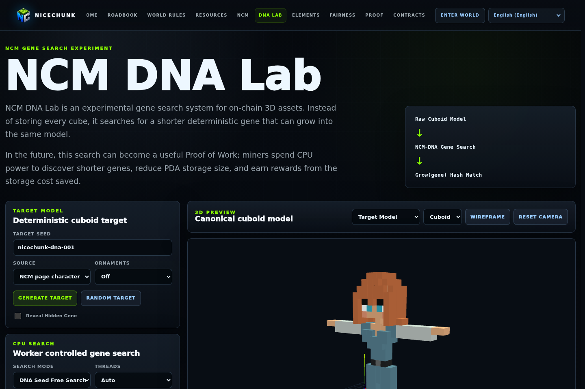
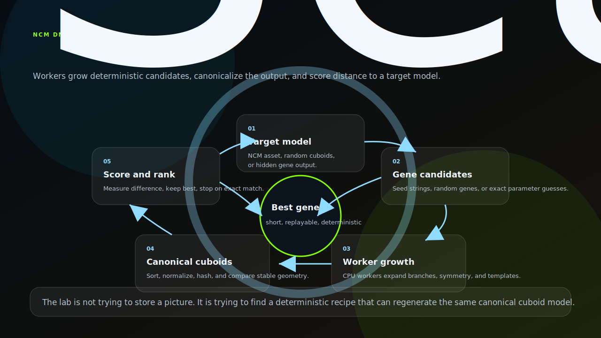
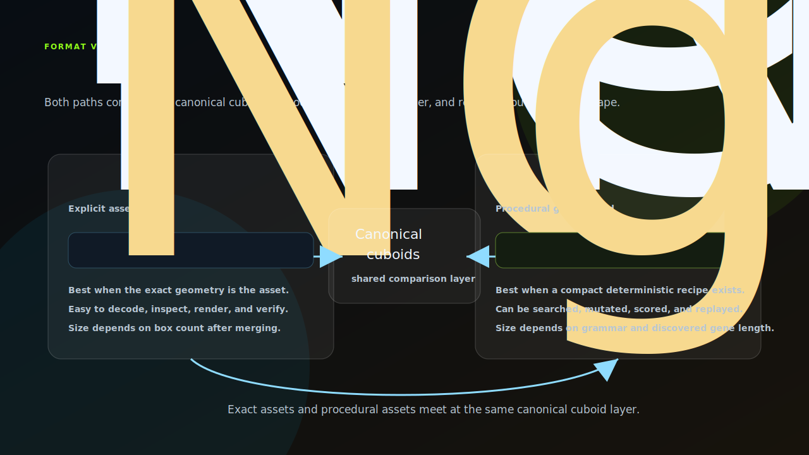

# NiceChunk NCM DNA

Deterministic cuboid gene search lab for NCM-like models.

## Project Overview

This repository contains the NCM DNA Lab. It explores deterministic gene strings that can grow into canonical cuboid models, with worker-based search and comparison views.

The project is research-oriented. It tests whether compact procedural genes can describe or rediscover NCM-style assets in a way that is easier to store and reason about than raw geometry.

It is separated from the NCM converter because it has a different purpose: NCM encodes assets, while NCM DNA searches for compact deterministic descriptions of assets.

## Architecture Diagrams

### Search Loop

NCM DNA is built around a search loop. The lab starts with a target model, then generates candidate genes. Worker threads grow each gene into a cuboid model, canonicalize the result, score it against the target, and keep the best candidate. The loop continues until it finds an exact match or the search budget is exhausted.

The important detail is that the target is not treated as a picture. It is treated as canonical geometry. That lets the lab compare shape, structure, and cuboid arrangement in a deterministic way. The same gene should always grow into the same model, so a successful gene becomes a replayable recipe rather than a static asset dump.

### Relationship To NCM

NCM and NCM DNA solve related but different problems. NCM stores explicit cuboid geometry. NCM DNA stores a procedural recipe that can grow into cuboid geometry. Both paths converge on canonical cuboids, which is the shared comparison and rendering layer.

That separation matters for future asset design. Some assets should be stored exactly as NCM because the authored geometry is the asset. Other assets may be better represented as compact deterministic genes if a short recipe can reproduce the target. The lab exists to test where that boundary is, not to assume one representation will replace the other.

## System Principles

- CPU-friendly search: the gene language uses branching, templates, symmetry, and canonical sorting that fit general CPU execution.
- Deterministic growth: the same gene and parameters should produce the same cuboid model.
- Comparison is essential: the UI must show target, best candidate, and differences clearly.
- Research code should remain inspectable so future format decisions can learn from failed experiments as well as successful ones.

## How It Works

- Open the NCM DNA page and generate or load a target model.
- Run a search mode and inspect candidate count, score, elapsed time, and best gene.
- Use side-by-side and diff rendering to evaluate whether a gene matches the target shape.
- Keep worker logic and renderer code synchronized when the model representation changes.

## Why This Project Matters

Procedural assets can reduce storage size and create new creative workflows, but they must remain deterministic and reviewable. NCM DNA is the experimental space for that question.

Separating the lab keeps speculative search algorithms away from production gameplay while still making the research public and forkable.

## Repository Layout

- `ncm_dna/`
- `src/vox/`
- `public/media/vox/`

## Development Workflow

1. Clone the repository and inspect the focused source tree before changing shared contracts or generated artifacts.
2. Keep changes scoped to the domain of this repository. Cross-domain changes should be coordinated through the matching split repositories.
3. Run the smallest meaningful validation for the touched surface: build checks for programs, browser checks for pages, or fixture checks for deterministic libraries.
4. Update screenshots and documentation when behavior, visible UI, public constants, or developer-facing workflows change.

## Future Development Direction

- Add reproducible benchmark suites for search modes.
- Document the gene grammar and canonical model comparison rules.
- Explore hybrid storage where NCM geometry and DNA genes can reference each other.
- Move promising algorithms into a reusable package once they stabilize.

## Maintenance Notes

This repository is a focused split from the main NiceChunk working tree. Keep the public surface explicit: avoid committing private keys, wallet files, deployment-only scripts, machine-specific configuration, or generated build artifacts. Runtime user-facing copy should stay behind the i18n layer where the project has an i18n surface.
